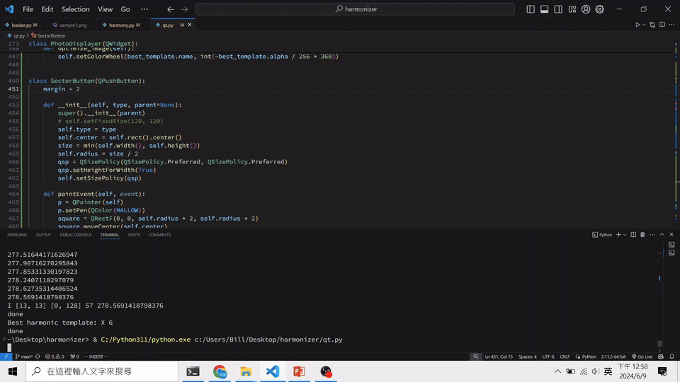
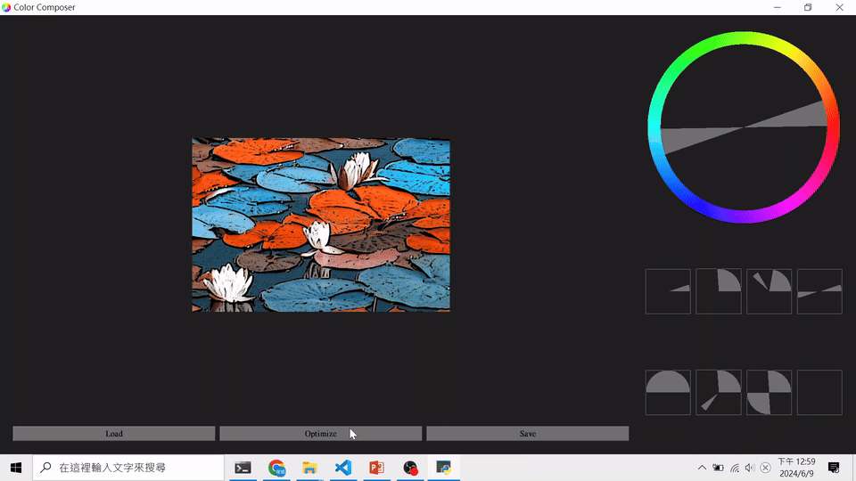

# Color Composer

Color Composer is a Python-based project that provides a user-friendly interface for color harmonization in images. The project uses `PyQt5` for the GUI and `PIL`, `numpy` for image processing.

### How to Use

```shell
python qt.py
```

#### Auto select template



#### Manually select template


#### Harmonize selected area



### Code Structure

- harmony.py: Contains a simplified color harmonization algorithm based on [Cohen-Or 2006](https://igl.ethz.ch/projects/color-harmonization/harmonization.pdf).
- qt.py: Contains the PyQt5 widgets used in the application.

## Installation

1. Clone the repository.

   ```shell
   git clone https://github.com/b10902118/color-composer.git
   ```

2. Install the dependencies (probably only adding pyqt5)

   ```shell
   cd color-composer
   pip install -r requirements.txt
   ```

## Dependency

- Python 3.9+ (developed on python 3.11.5)
- PyQt5
- PIL

## TODO

- [ ] Add color layers decomposition
- [ ] More shape of selection
- [ ] Undo & Redo
